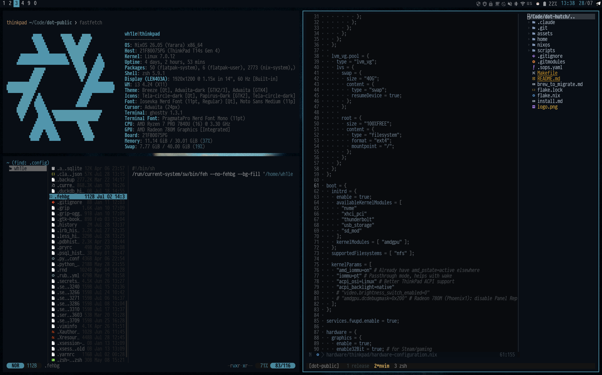
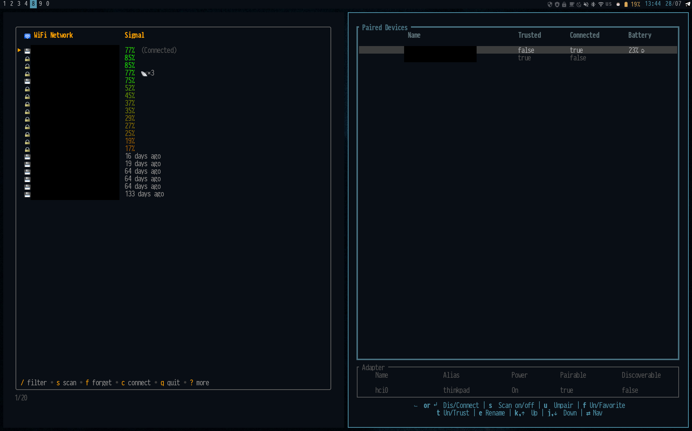
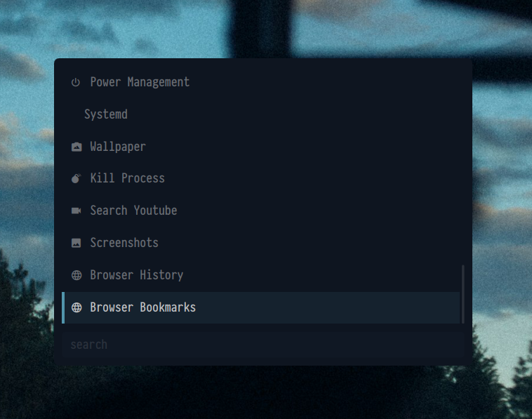
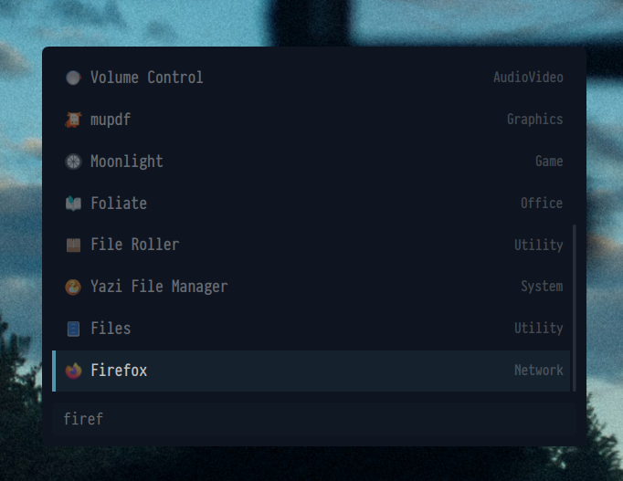
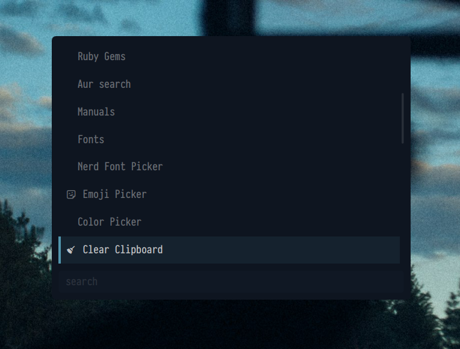
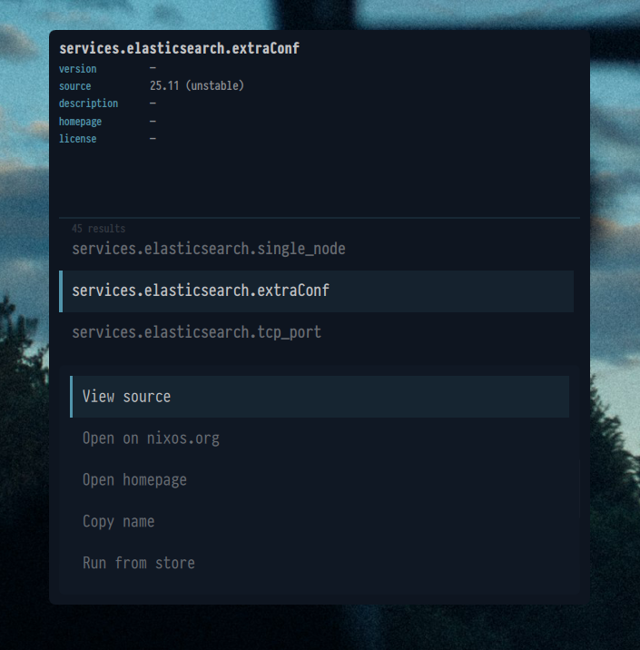
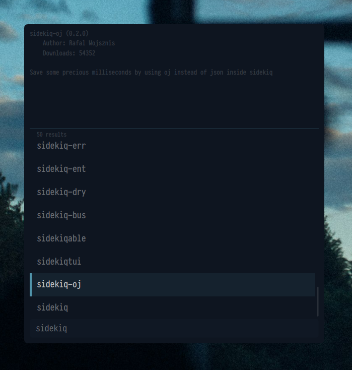
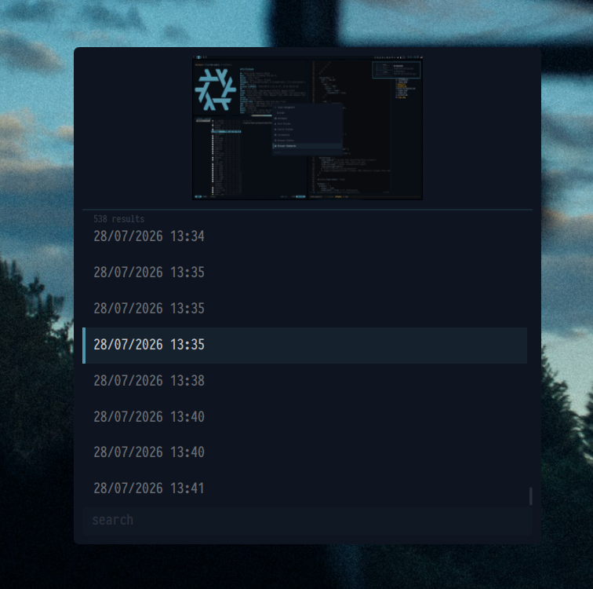
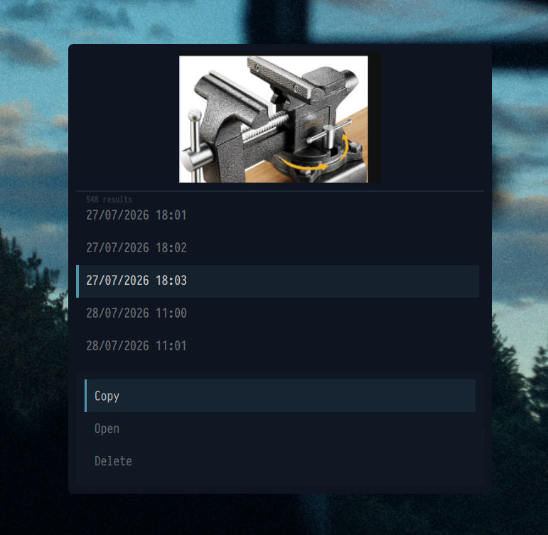

# dot-hutch

NixOS + home-manager dotfiles. Flake-based, multi-host.



## Daily driver

- **WM:** i3 + i3blocks
- **Launcher:** quickshell module
- **Passwords:** pass
- **Files:** yazi / nautilus (migrating to yazi)
- **Editor:** nvim
- **Terminal:** ghostty / tmux
- **Shell:** zsh
- **Colors:** pywal (system-wide theming)

Hyprland config is here too but likely broken after switching back to i3. It was fully completed but I wasn't able to run VR properly with screensharring as I do on x11

## Screenshots

WiFi and Bluetooth managed from TUIs (network names redacted):



### Launcher (quickshell)

A custom launcher that goes past app-launching, it searches Nix options, Ruby gems, screenshoots, and clipboard history, and drives all my system actions. See [`home/.config/quickshell_launcher`](home/.config/quickshell_launcher).

|                                                                         |                                                      |
| ----------------------------------------------------------------------- | ---------------------------------------------------- |
|                      | Main menu — power, wallpaper, screenshots, bookmarks |
|           | App search                                           |
|              | Extras — fonts, emoji, color picker, clipboard       |
|   | Search NixOS options inline                          |
|           | Search Ruby gems                                     |
|          | Clipboard history with previews                      |
|  | Clipboard entry actions — copy / open / delete       |

## Hosts

| Host       | Type  | Config       |
| ---------- | ----- | ------------ |
| `homepc`   | NixOS | `.#homepc`   |
| `thinkpad` | NixOS | `.#thinkpad` |

## Build

```sh
# NixOS
sudo nixos-rebuild switch --flake .#thinkpad

# macOS
make mac              # or: ./scripts/deploy-on-mac
```

Secrets are managed with [sops-nix](https://github.com/Mic92/sops-nix) — encrypted, keys live outside the repo.

## Layout

```
flake.nix              inputs + host definitions
nixos/system/          host configs, hardware, packages
nixos/home/            home-manager (user dotfiles)
home/.config/          raw config files (i3, nvim, yazi, ...)
scripts/               deploy helpers
```
